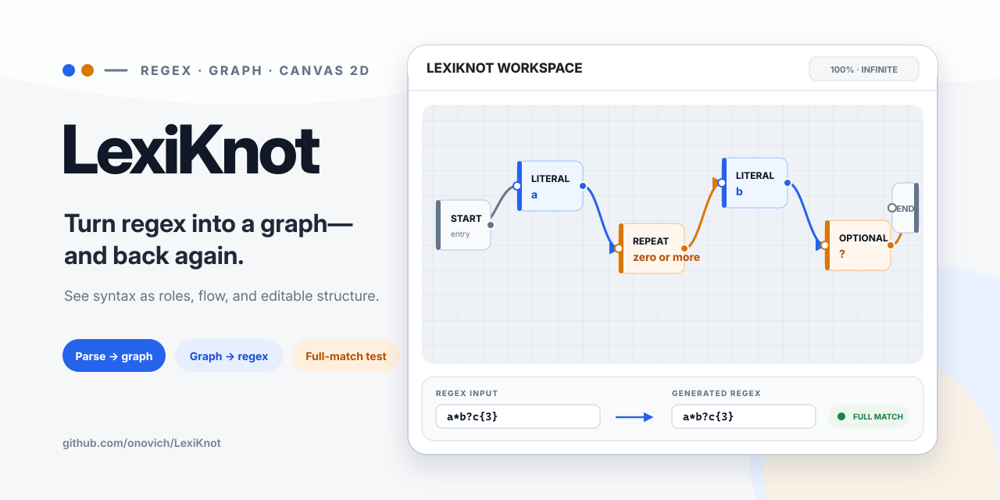

# LexiKnot

[简体中文](README.zh-CN.md)

A TypeScript tool that turns regular expressions into an editable infinite-canvas graph and back again.



## What it includes

- Regex-to-graph and graph-to-regex flow.
- Infinite-canvas editing.
- TypeScript tests.

## Getting started

Install dependencies and start the local version:

```bash
npm install
npm run dev
```

The repository also provides `npm run build`、`npm run test`、`npm run lint`.

## Repository map

- `src/` — Application and library source.
- `docs/` — Project documentation and design notes.
- `tests/` — Automated tests and validation fixtures.
- `index.html` — Web entry point.
- `package.json` — Package scripts and dependencies.

## Documentation

- [`docs/LexiKnot-project-brief.md`](docs/LexiKnot-project-brief.md)
- [`docs/project-knowledge.md`](docs/project-knowledge.md)
- [`docs/progress.md`](docs/progress.md)

## Status

The repository contains the implementation and project material described above. Automated tests are included; compatibility still depends on the target runtime, editor, or platform.

## License

No open-source license is currently included in this repository.
